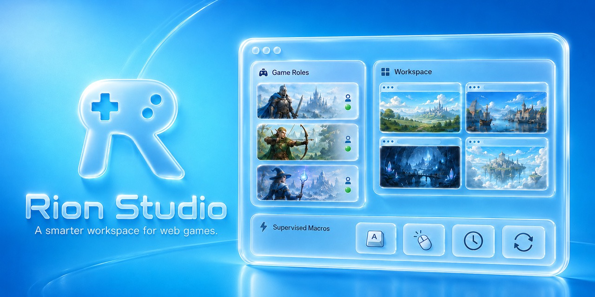

# Rion Studio

[English](../README.md) | [繁體中文](README.zh-TW.md) | 简体中文 | [日本語](README.ja.md)



**跨平台的网页游戏登录启动器与辅助工作区。**

Rion Studio 帮助网页游戏玩家在一个桌面 App 中整理每个角色、登录会话和浏览器布局。你可以创建专用的浏览器角色、降低登录阻力、启动熟悉的窗口排列，并在主动掌控游戏时减少重复的手动操作。

## 下载

- [下载 macOS 版](https://github.com/rion-tw/rion-studio/releases/latest/download/Rion.Studio-mac.dmg)
- [下载 Windows 版](https://github.com/rion-tw/rion-studio/releases/latest/download/Rion.Studio-win.exe)

这些链接会指向最新 GitHub Release 附加的安装文件。如果下载时出现 404，请打开[最新 release](https://github.com/rion-tw/rion-studio/releases/latest)，确认 release 资源已完成上传。

### macOS 安装

macOS 内测版使用 ad-hoc 签名，尚未通过 Apple Developer ID notarization。请打开 DMG、将 Rion Studio 拖到 Applications，然后先尝试打开一次。如果 macOS 阻止打开，请前往 **System Settings > Privacy & Security**，再对 Rion Studio 点击 **Open Anyway**。

如果没有出现 **Open Anyway**，且你信任下载来源，可以在 Terminal 使用这个一次性的备用命令：

```bash
xattr -dr com.apple.quarantine "/Applications/Rion Studio.app"
```

这个备用命令只会移除 Rion Studio 的 quarantine 属性，不会替 App 完成 notarization，也不会在系统层级停用 Gatekeeper。

## 为什么使用 Rion Studio

网页游戏经常让玩家同时处理多个账号、浏览器窗口、登录状态和重复的例行操作。Rion Studio 将这些分散的流程整理成一个专注的控制台：

- 让每个游戏角色保持各自隔离的浏览器会话。
- 回到已保存的窗口布局，不必每次重新配置。
- 在需要时通过系统 Chrome 完成敏感的登录流程。
- 在你的监督下执行小型辅助宏，例如按键、点击、延迟和循环。
- 不把密码存进 App。Rion Studio 只保存浏览器会话数据。

## 功能

### 隔离角色浏览器

为每个游戏账号、角色或任务创建一个角色。每个角色都有自己的浏览器目录，因此会话会保持分离，并可独立启动。

### 更顺畅的登录流程

有些服务会阻止在自动化控制浏览器中的登录。Rion Studio 可以使用同一个角色目录打开系统 Chrome 进行登录，然后在启动普通内置浏览器前验证已保存的会话。

### 启动工作区

将角色分组成启动工作区，并为每个角色指定窗口布局。你可以启动单个角色，或一次启动完整的多角色配置，回到已准备好的排列方式。

### 中国大陆 CDN 兼容模式

改善 Google 托管资源无法连接时的加载状况。可选的兼容模式能够自动检测受限连接，并在内嵌与外部 Chrome 会话中，将支持的 Google Fonts、Hosted Libraries、reCAPTCHA、Gravatar、Bootstrap 和 jQuery 资源网址替换为更容易连接的替代来源。这是针对特定资源的网址改写功能，不是 VPN 或代理服务。

### 人为监督的宏

使用按键、点击、延迟和重复间隔创建精简的辅助宏。宏的设计目标是在你仍然在场、监督并操作游戏时，减少重复的手动输入。

## 法律与合理使用声明

Rion Studio 是独立的通用启动器及人工监督辅助工具，与任何游戏、身份验证服务或第三方平台均无隶属或背书关系。请遵守目标服务规则，且不得用于无人机器人、反作弊规避、漏洞利用、干扰或违法活动。

- [使用条款](legal/terms.zh-CN.md)
- [隐私声明](legal/privacy.zh-CN.md)
- [公平使用规范](legal/fair-use.zh-CN.md)
- [第三方软件声明](legal/THIRD_PARTY_NOTICES.md)

## 支持与反馈

此仓库是 Rion Studio 的公开下载与产品支持入口。产品错误报告及功能建议请使用
[GitHub Issues](https://github.com/rion-tw/rion-studio/issues)。我们不接受源代码 Pull Request；
请参阅 [`../SUPPORT.md`](../SUPPORT.md) 与 [`../SECURITY.md`](../SECURITY.md) 选择正确的联系渠道。
